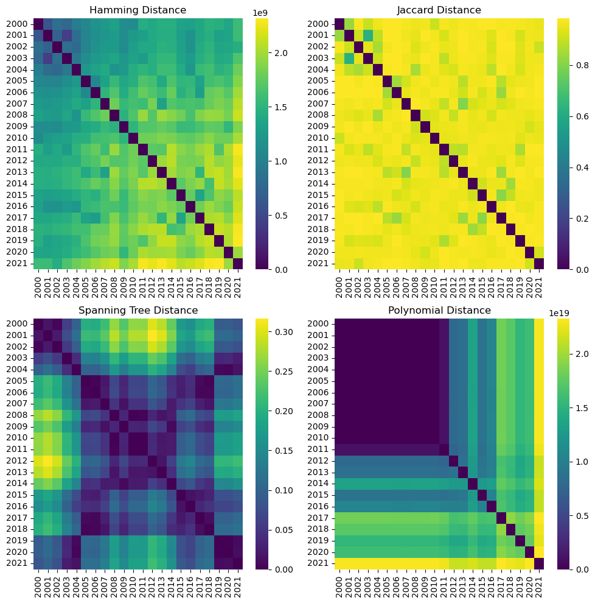

# WTO-Network-Distances

This project utilizes four graph distance metrics proposed in Donnat and Holmes (2018) paper to understand how trade has evolved by region. Three regions are examined - Asia, North America, and Europe using the Hamming, Jaccard, spanning tree, and polynomial distances. To analyze how they perform, heatmap visualizations, MDS projections, and clustering metrics were implemented. These showed that the spanning tree distance works best for a classification task, whereas the polynomial distance works better for a chang-point detection task.

## Data
The data comes from the Atlas of Economic Complexity that is part of the Harvard Growth Lab. Years 2000-2021 were used for this paper, and the amount of trade was aggregated across all goods for each pair of country trade.

